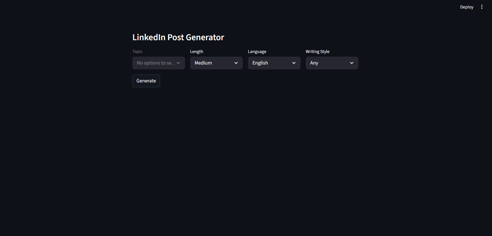

# 🚀 LLM-Powered LinkedIn Post Generator

An AI-powered application that generates high-quality LinkedIn posts using Large Language Models (LLMs) with controllable tone, length, language, and writing style (persona-based generation).

---

## 🔥 Features

- Generate LinkedIn posts based on topic, length, and language  
- Persona-based writing styles (multiple authors)  
- Few-shot learning for improved output quality  
- Dynamic topic filtering based on selected writing style  
- Optional emoji inclusion  
- Real-time generation using LLM APIs (Groq / OpenAI-compatible)  

---

## 🧠 How It Works

1. User selects:
   - Topic  
   - Length  
   - Language  
   - Writing Style (Persona)  

2. System:
   - Filters relevant examples from dataset  
   - Selects top examples based on engagement  
   - Constructs a dynamic prompt  

3. LLM generates:
   - Structured LinkedIn post  

---

## 🏗️ Architecture

User Input → Data Filtering → Few-Shot Example Selection → Prompt Construction → LLM → Output

---

## 🛠️ Tech Stack

- Python  
- Streamlit  
- LangChain  
- Groq API (LLM)  
- Pandas  

---

## 📸 Demo

### Application UI  

### Generated Output  

---

## ✨ Sample Output

We prioritize deadlines. But neglect self-care. Stress builds up. Anxiety kicks in. Sleepless nights.

That's not productivity. That's a ticking bomb 🚨. Take a breath 🌟. Prioritize your mental health 🧠. Your well-being matters 💖.

---

## 🙌 Acknowledgment

This project was inspired by a foundational LinkedIn post generator tutorial by Codebasics.  
I extended the base idea by implementing persona-based content generation, dynamic filtering logic, and a structured few-shot prompting pipeline.

